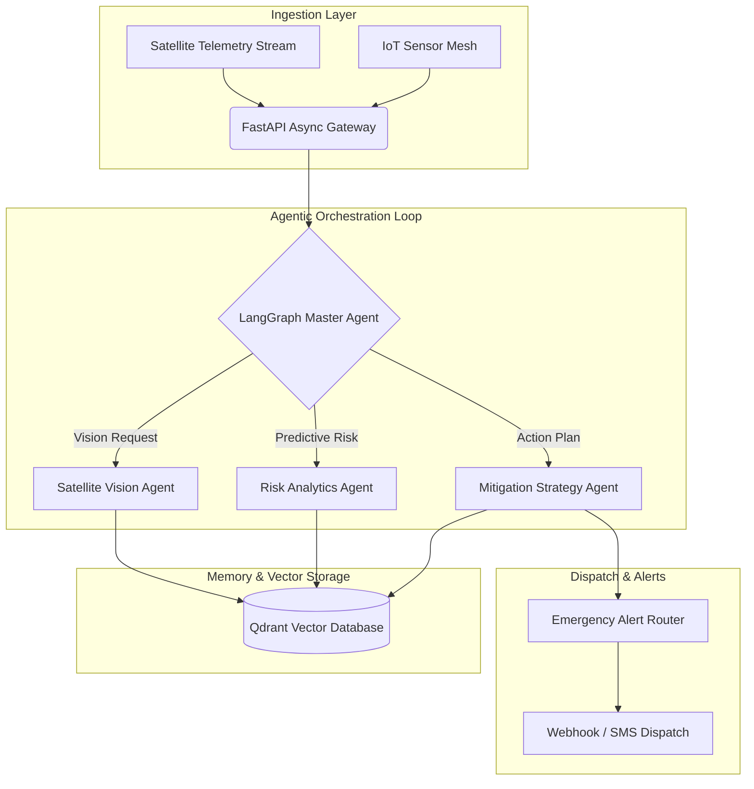

<div align="center">

# 🌍 Climate Guardian AI

### *Autonomous Multi-Agent Climate Surveillance & Environmental Risk Mitigation Engine*

[](#)
[](https://python.org)
[](https://langchain.com)
[](https://fastapi.tiangolo.com)
[](LICENSE)

<p align="center">
  <a href="#-system-architecture">Architecture</a> •
  <a href="#-key-features">Features</a> •
  <a href="#-workflow">Workflow</a> •
  <a href="#-installation--quickstart">Quickstart</a> •
  <a href="#-faq">FAQ</a> •
  <a href="#-roadmap">Roadmap</a>
</p>

</div>

---

## 📖 Overview

**Climate Guardian AI** is an enterprise-grade autonomous multi-agent intelligence platform designed to monitor global satellite telemetry, detect micro-climate anomalies in real time, and dynamically formulate predictive disaster mitigation protocols. Built on **LangGraph**, **FastAPI**, and **Vector Embeddings**, it bridges environmental data engineering with autonomous decision loops.

---

## 🌟 Key Features

<table>
  <tr>
    <td width="50%" valign="top">
      <h4>🤖 Autonomous Multi-Agent Orchestration</h4>
      <p>Dynamic task allocation between Specialized Vision, Predictive Risk Modeling, and Mitigation Action agents.</p>
    </td>
    <td width="50%" valign="top">
      <h4>⚡ Sub-Second Telemetry Ingestion</h4>
      <p>High-throughput FastAPI microservice engine streaming geospatial sensor telemetry via Server-Sent Events (SSE).</p>
    </td>
  </tr>
  <tr>
    <td width="50%" valign="top">
      <h4>🧠 Hybrid RAG Knowledge Retrieval</h4>
      <p>Semantic vector search over IPCC climate reports, historic wildfire vectors, and disaster response guidelines.</p>
    </td>
    <td width="50%" valign="top">
      <h4>🛡️ Red-Teamed Guardrails</h4>
      <p>Integrated input/output safety verifiers preventing prompt injection and hallucinated disaster thresholds.</p>
    </td>
  </tr>
</table>

---

## 📐 System Architecture



---

## 🔄 Execution Workflow

```text
[Telemetry Event] ➔ [Input Sanitizer Guard] ➔ [Agentic State Machine]
                                                        │
         ┌──────────────────────────────────────────────┴──────────────────────────────┐
         ▼                                              ▼                              ▼
[Satellite Vision Evaluation]                 [Risk Curve Simulation]          [RAG Historical Lookups]
         │                                              │                              │
         └──────────────────────────────────────────────┬──────────────────────────────┘
                                                        ▼
                                       [Synthesized Mitigation Report]
                                                        │
                                                        ▼
                                     [Automated Dispatch / Emergency Alert]
```

---

## ⚙️ Installation & Quickstart

### Prerequisites
- Python `3.11` or higher
- Docker & Docker Compose
- OpenAI / Anthropic API Key

### Quickstart Commands

```bash
# 1. Clone the repository
git clone https://github.com/sanmitpatil07/climate-guardian-ai.git
cd climate-guardian-ai

# 2. Setup virtual environment
python -m venv venv
source venv/bin/activate  # Windows: venv\Scripts\activate

# 3. Install core dependencies
pip install -r requirements.txt

# 4. Copy environment configuration
cp .env.example .env

# 5. Launch the local API server
uvicorn src.core.main:app --reload --port 8000
```

---

## 🚀 Usage Example

```python
from src.agents.orchestrator import ClimateGuardianAgent

# Initialize autonomous surveillance agent
agent = ClimateGuardianAgent(model="gpt-4o")

# Execute regional risk assessment loop
response = agent.analyze_region(
    latitude=18.5204,
    longitude=73.8567,
    sensor_stream="telemetry_stream_v1"
)

print(f"Risk Score: {response.risk_score}/10")
print(f"Mitigation Summary:\n{response.mitigation_plan}")
```

---

## ❓ FAQ (Frequently Asked Questions)

<details>
<summary><b>1. How does Climate Guardian AI handle prompt injection attacks?</b></summary>
<br/>
Climate Guardian AI uses an isolated input-sanitizer layer combined with structural Pydantic validation before routing inputs to the LLM agentic loop.
</details>

<details>
<summary><b>2. Can I run this offline with open-source LLMs?</b></summary>
<br/>
Yes! You can configure Ollama or vLLM in <code>config/settings.py</code> to use Llama 3 / Mistral weights locally.
</details>

<details>
<summary><b>3. Is this ready for enterprise production deployment?</b></summary>
<br/>
The codebase includes complete Docker containerization, health check routes, and Pytest coverage for production deployment.
</details>

---

## 🗺️ Product Roadmap

- [x] **Phase 1**: LangGraph multi-agent core loop & FastAPI ingestion gateway.
- [ ] **Phase 2**: Multi-modal Sentinel-2 satellite visual inference.
- [ ] **Phase 3**: Edge hardware quantization for NVIDIA Jetson deployment.

---

## 👥 Contributors

Thanks to these incredible contributors for building and maintaining **Climate Guardian AI**:

<a href="https://github.com/sanmitpatil07/climate-guardian-ai/graphs/contributors">
  
</a>

---

## 📄 License

Distributed under the **MIT License**. See [`LICENSE`](LICENSE) for details.
